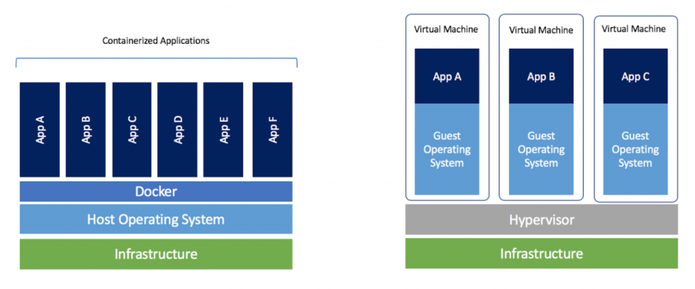

# Docker-Compose

Comprender aspectos de la teoría de Sistemas Operacionales como fundamento para gestionar sistemas operativos.

## Objetivos específicos
• Identificar e implementar una arquitectura de tipo cliente servidor.

## ¿Qué es Docker?

Docker es una plataforma de software que le permite crear, probar e implementar aplicaciones rápidamente. Docker empaqueta software en unidades estandarizadas llamadas contenedores que incluyen todo lo necesario para que el software se ejecute, incluidas bibliotecas, herramientas de sistema, código y tiempo de ejecución. Con Docker, puede implementar y ajustar la escala de aplicaciones rápidamente en cualquier entorno con la certeza de saber que su código se ejecutará.

* siempre te permitira correr tu aplicación en un mismo entorno
* facilidad al mover
* sandbox

## Cómo funciona Docker

Docker le proporciona una manera estándar de ejecutar su código. Docker es un sistema operativo para contenedores. De manera similar a cómo una máquina virtual virtualiza (elimina la necesidad de administrar directamente) el hardware del servidor, los contenedores virtualizan el sistema operativo de un servidor. Docker se instala en cada servidor y proporciona comandos sencillos que puede utilizar para crear, iniciar o detener contenedores.

## Diferencia entre Docker y una maquina virtual

Las máquinas virtuales (VM) virtualizan (o eliminan la necesidad de administrar directamente) el hardware del servidor, mientras que los contenedores virtualizan el sistema operativo de un sistema. Docker es un sistema operativo (o runtime) para contenedores. El motor de Docker se instala en cada servidor en el que desee ejecutar contenedores y proporciona un conjunto sencillo de comandos que puede utilizar para crear, iniciar o detener contenedores.

